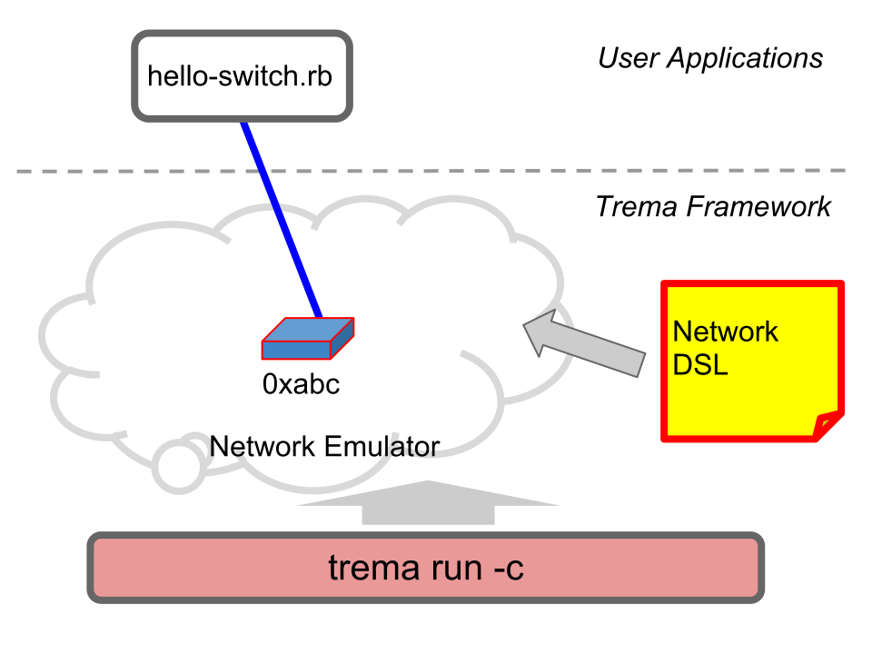

<!SLIDE>
# Task B: Hello Switch! ########################################################
## OpenFlow スイッチとコントローラを接続

<!SLIDE>
## "OpenFlow スイッチは持ってない. どうすればいい？"

<!SLIDE small>
# "Hello Switch" を実行 ########################################################

	$ trema run hello-switch.rb -c hello-switch.conf
	Password: vagrant
	Hello 0xabc!  # Ctrl-c to quit

* <b>OpenFlow ソフトウェアスイッチ</b>を起動しコントローラと接続
* スイッチの Datapth ID = 0xabc
* コントローラは `"Hello 0xabc!"` と表示
* スイッチの起動は `hello-switch.conf` で定義

<!SLIDE center>

<!SLIDE small>
# hello-switch.conf ############################################################

	@@@ ruby
	# Add a switch with dpid == 0xabc

	vswitch { dpid "0xabc" }

	# or

	vswitch { datapath_id "0xabc" }

* 使いたいスイッチを設定ファイルに書くだけ
  * ソフトウェアスイッチが起動し、コントローラと接続
* Trema は<b>フルスタック</b>
  * 物理スイッチを持ってなくてもノート PC 一台で OK

<!SLIDE small>
# `hello-switch.rb` ############################################################

	@@@ ruby
	class HelloSwitch < Controller
	  def switch_ready(dpid)
	    info "Hello #{ dpid.to_hex }!"
	  end
	end

* `switch_ready`: スイッチが接続したときに呼ばれるハンドラ
* `dpid` 引数: 接続してきたスイッチの ID が格納
* `.to_hex` をつけることで `dpid` を 16 進文字列に変換

<!SLIDE small>
# 演習: スイッチの追加 #########################################################

	@@@ ruby
	# hello-switch.conf
	vswitch { dpid "0x1" }
	vswitch { dpid "0x2" }
	vswitch { dpid "0x3" }
	  ...

	$ trema run hello-switch.rb -c hello-switch.conf
	???

* `hello-switch.conf` にスイッチを追加して `trema run` すると？
* 注 : 各スイッチの dpid はユニークにすること

<!SLIDE medium incremental transition=uncover>
# ここまでのサマリー ###########################################################

## Trema は "Post-Rails" でモダンなフレームワーク

 

* 書いたコードをすぐ動かせる: `trema run`
* Coding by Convention: ハンドラの自動ディスパッチ
* フルスタック: ネットワークのエミュレーション
* 便利なサブコマンド : `trema ruby`
