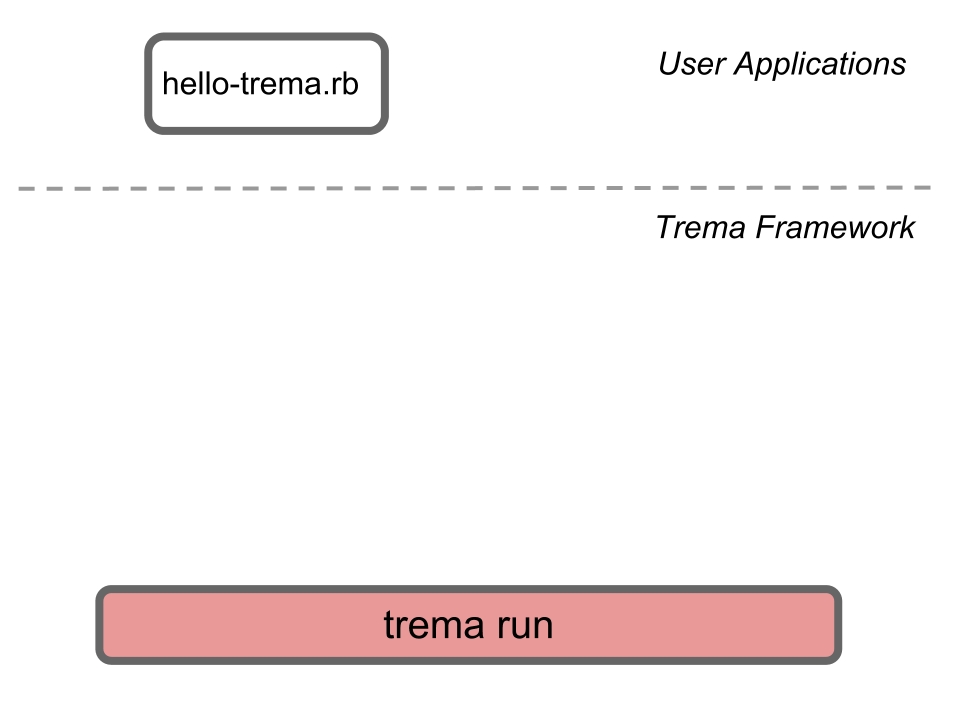

<!SLIDE>
# Task A: Hello Trema! #########################################################

<!SLIDE commandline>
## 演習: "Hello Trema!" を実行 #############################################

### 以下のコマンドを入力し、Trema を実行します :

	$ cd Tutorials/Trema
	$ trema run hello-trema.rb
	Hello Trema!   # Ctrl-C to quit

<!SLIDE center>

<!SLIDE small>
# 基本コマンド : `trema run` ###############################################

	$ trema run [controller-file]

* 上記コマンドで、コントローラを実行します
* Ctrl-c で停止します
* `trema help run` でオプションリストを表示します

<!SLIDE small>
# 書いたコードをすぐ動かす #################################################################

* `trema run` コマンドで、書いたコントローラをすぐ実行できます
* 書いたコントローラを、即座にテストできます
* 短いサイクルで "コーディング、テスト、デバッグ" を繰り返す開発スタイルを実現できます

<!SLIDE small>
# Trema 上での コントローラの書き方 #############################################

<!SLIDE small>
# hello-trema.rb ###############################################################

	@@@ ruby
	class HelloController < Controller
	  def start
	    info "Hello Trema!"
	  end
	end

* シンプルですが、これだけで完全なコントローラのコードになっています
* (ただし Hello Trema! と表示するだけのものです)

<!SLIDE small>
# コントローラクラス #############################################################

	@@@ ruby
	class HelloController < Controller
	  # ...
	end

* すべてのコントローラは、クラスとして実装します (`class HelloController`)
* Trema クラスライブラリに用意されている `Controller` クラスのサブクラスとして実装します
* コントローラに必要なメソッドは、自動的に継承されます (flow-mod メッセージの送信等)

<!SLIDE small>
# イベントハンドラ ###############################################################

	@@@ ruby
	class MyController < Controller
	  def start  # start-up event handler
	    # ...
	  end
	      
	  def packet_in dpid, msg  # Packet-in received handler
	    # ...
	  end
	
	  # ...
	end

* イベントドリブン形式で、コントローラを記述します
* 各イベントハンドラを、インスタンスメソッドとして実装します

<!SLIDE small>
# イベントハンドラ (Floodlight の場合) #################################################

	@@@ java
	// Packet-in handling in Floodlight
	public Command receive(IOFSwitch sw, ...) {
	  switch (msg.getType()) {
	    case PACKET_IN:
	      return this.handlePacketIn(sw, ...);
	    ...
	private Command handlePacketIn(IOFSwitch sw, ...) {
	    ...

* Floodlight では、複雑なイベント振り分けを必要とします
* おまじないが多いため、コードの見通しが悪くなります

<!SLIDE small>
# イベントの振り分け ################################################################

	@@@ ruby
	# Packet-in handling in Trema
	class MyController < Controller
	  def start  # automatically called at startup
	    # ...
	  end
	      
	  def packet_in dpid, msg  # automatically caled when receiving a packet-in
	    # ...
	  end
	end

* Trema はイベントの振り分けにリフレクションを使っています
* そのため、複雑になりがちなディスパッチやハンドラ登録を行う必要はありません

<!SLIDE small transition=uncover>
# コーディングのための工夫 #######################################################

* 簡潔なコードを書くための工夫
  * e.g., "handler name" == "message name"
* イベントディスパッチのような、おまじないを不要に
* 楽しいプログラミングのために、お約束事やつまらない部分を削減

<!SLIDE small>
# 短く書く ################################################################

* コードの長さと生産性の間には強い相関関係
  * e.g. Arc Programming Language [Paul Graham]
* コードを短くすることで、
  * お約束コードを書く時間を最小にする
  * バグ混入の可能性を少なくする

 

## Trema は、実行時の効率性よりも
## <b>プログラマーの生産性</b>に重きをおいています

<!SLIDE small>
# Logging API ##################################################################

	@@@ ruby
	class HelloController < Controller
	  def start
	    info "Hello Trema!"	 # outputs an info level message
	  end
	end

* ロギングレベル毎に用意されたシンプルな API (debug, info, etc)
* `trema ruby` で、Logging API を含む API リファレンスを表示

