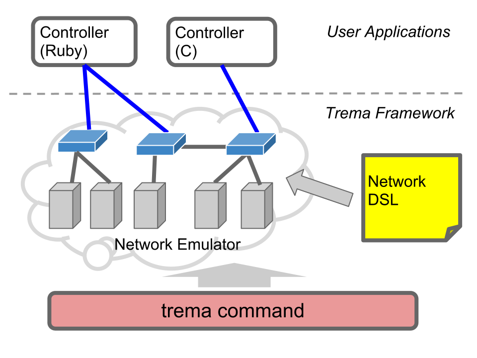

<!SLIDE title-slide>
# 作ってわかる OpenFlow ########################################################
## Trema チュートリアル＆ハンズオン

### 高宮 安仁
### 須堯 一志

<!SLIDE incremental>
# 本日のゴール #################################################################

### "トラフィックモニターつき L2 スイッチ" の実装

* Trema による OpenFlow コントローラの開発サイクルを体験
* "Hello World" から始め 5 つの課題
* Tutorial Kit: <https://github.com/trema/tutorial.files>

<!SLIDE incremental>
# Trema とは ###################################################################

* Ruby 用 OpenFlow 開発フレームワーク
  * <http://github.com/trema/trema>
  * GPL2
* <i>Post-Rails</i>: 高い生産性
  * 書いたコードをすぐ動かせる
  * よくある処理を短く書ける
  * 統合されたテスト環境

<!SLIDE>
# Trema = ######################################################################
## OpenFlow の Ruby ライブラリ
## +
## ネットワークエミュレータ
## +
## `trema` コマンド

<!SLIDE center>

