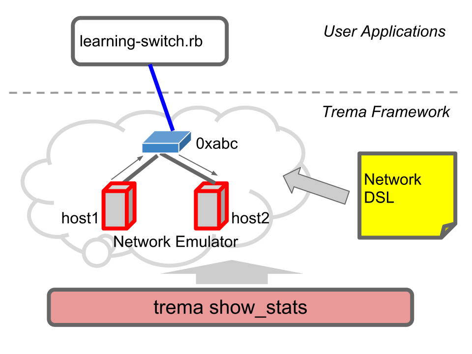
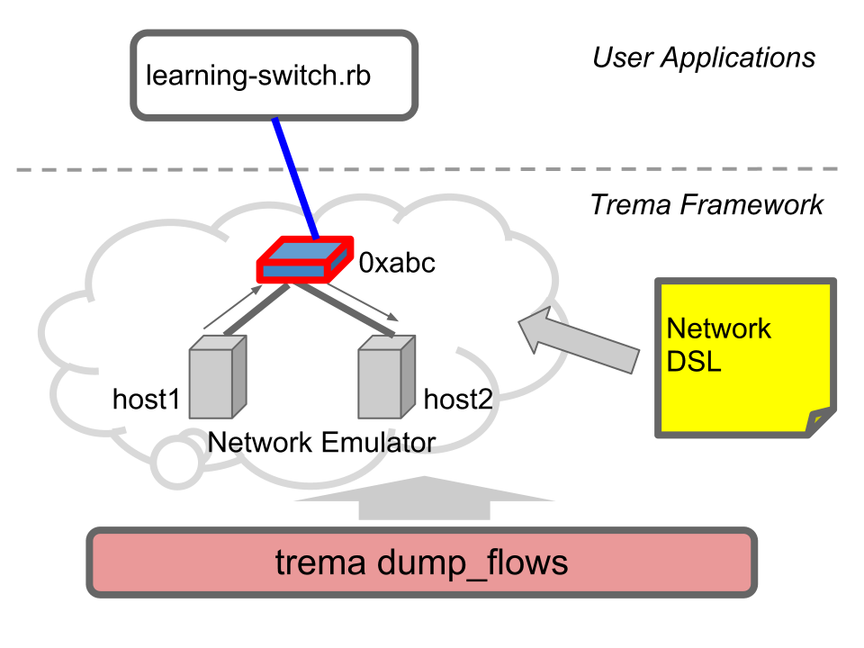

<!SLIDE>
# Task D: Learning Switch ######################################################

## FlowMod と PacketOut を送る

<!SLIDE small>
# 送受信パケット量を表示 #######################################################

## L2 スイッチ (learning_switch) を起動:

	$ trema run learning-switch.rb -c learning-switch.conf

 
 

## 別のターミナルでテストパケットを送る
## `show_stats` で送受信パケット量を表示

	$ trema send_packet --source host1 --dest host2
	$ trema show_stats host1
	$ trema show_stats host2

<!SLIDE center>

<!SLIDE medium>
# フローテーブルを見よう #######################################################

## スイッチ 0xabc のフローテーブルを表示

	$ trema send_packet --source host2 --dest host1
	$ trema dump_flows 0xabc

<!SLIDE center>

<!SLIDE small>
# 新しいサブコマンド ###########################################################

* `trema show_stats HOST_NAME`
* `trema dump_flows SWITCH_NAME`

## 様々な統計情報と内部情報を表示可能

<!SLIDE small>
# Learning Switch のソースコード ###############################################

<!SLIDE small>
# Learning Switch ##############################################################

	@@@ ruby
	class LearningSwitch < Controller
	  # ...
	  def packet_in(dpid, message)
	    @fdb.learn message.macsa, message.in_port
	    port_no = @fdb.lookup(message.macda)
	    if port_no
	      flow_mod dpid, message, port_no
	      packet_out dpid, message, port_no
	    else
	      flood dpid, message
	    end
	  end
	  # ...
	end

# 擬似コードのようにスラスラ読める(？)

<!SLIDE smaller>
# 詳しく見る ###################################################################

	@@@ ruby
	class LearningSwitch < Controller
	  # ...
	  def packet_in(dpid, message)
	    @fdb.learn message.macsa, message.in_port
	    port_no = @fdb.lookup(message.macda)
	    if port_no
	      flow_mod dpid, message, port_no
	      packet_out dpid, message, port_no
	    else
	      flood dpid, message
	    end
	  end
	  # ...
	end

* PacketIn を受け取り、送信元 MAC アドレス (macsa) と受信ポート (in_port) を Forwarding DB (FDB) に記録
* 宛先 MAC アドレス (macda) から送出ポートを検索する
* もし見つかれば、スイッチのフローテーブルを更新して、パケットを PacketOut
* 見つからなければ、パケットを flood

<!SLIDE small>
# プライベートメソッド #########################################################

* `flow_mod`, `packet_out`, `flood` はプライベートメソッド
  * 標準の Trema API をラップしたもの
  * `#packet_in` を短く, 読みやすくするために定義
* 適切なネーミングはコードの可読性を高める

<!SLIDE small>
# `#flow_mod` ##################################################################

	@@@ ruby
	class LearningSwitch < Controller
	  # ...
	  private
	  def flow_mod(dpid, message, port_no)
	    send_flow_mod_add(
	      dpid,
	      :match => ExactMatch.from(message),
	      :actions => ActionOutput.new(port_no)
	    )
	  end
	  # ...
	end

* 受信パケットからマッチ条件を作り、指定のポートに出力
* 短く見通しのよいコード

<!SLIDE small>
# Syntactic Sugar: `ExactMatch.from()` #########################################

	@@@ ruby
	ExactMatch.from(message)

# vs.

	@@@ ruby
	Match.new(
	  :in_port => message.in_port,
	  :nw_src => message.nw_src,
	  :nw_dst => message.nw_dst,
	  :tp_src => message.tp_src,
	  :tp_dst => message.tp_dst,
	  :dl_src => message.dl_src,
	  :dl_dst => message.dl_dst,
	  ...
	)

<!SLIDE small>
# Trema vs. NOX Python #########################################################

	@@@ ruby
	# Trema
	send_flow_mod_add(
	  dpid,
	  :match => ExactMatch.from(message),
	  :actions => ActionOutput.new(port_no)
	)

# vs.

	@@@ python
	# NOX Python
	inst.install_datapath_flow(
	  dpid,
	  extract_flow(packet),
	  CACHE_TIMEOUT,
	  openflow.OFP_FLOW_PERMANENT,
	  [[openflow.OFPAT_OUTPUT, [0, prt[0]]]],
	  bufid,
	  openflow.OFP_DEFAULT_PRIORITY,
	  inport,
	  buf
	)

<!SLIDE small>
# Learning Switch: まとめ ######################################################

* 内部の状態表示 : `trema show_stats`, `trema dump_flows`
* 短く書くための API: `ExactMatch.from`, `send_flow_mod_add`
