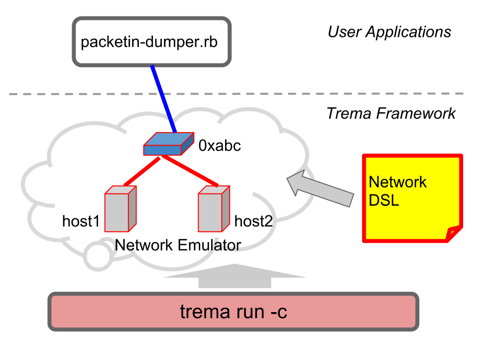
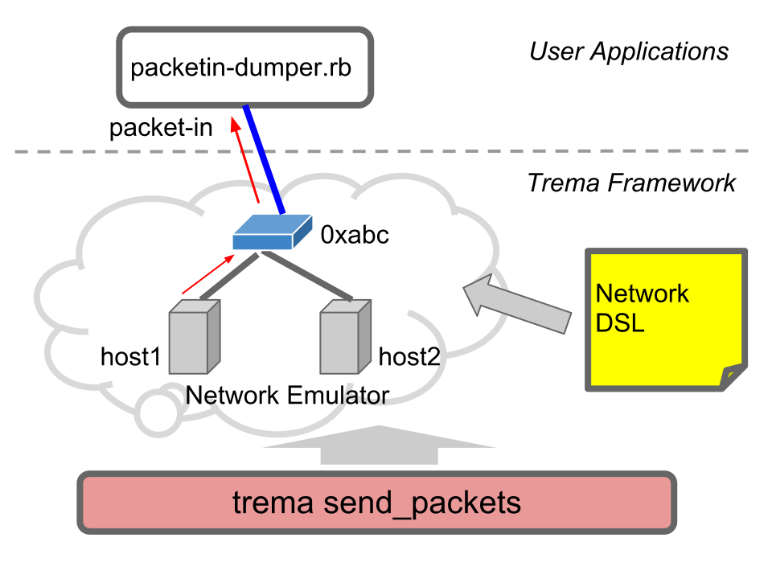

<!SLIDE small>
# Task C: Packet-In Dumper #####################################################

## Packet-In メッセージの扱い

<!SLIDE small>
## 演習 : Packet-In メッセージの内容を表示 #############################

	$ trema run packetin-dumper.rb -c packetin-dumper.conf

* Packet-In dumper コントローラを起動します
* 仮想ネットワークも同時に起動します (= 1 台の仮想スイッチと 2 台の仮想ホスト host1, host2)

<!SLIDE center>

<!SLIDE small>
## 演習 : Packet-In メッセージの内容を表示 #############################

	$ trema send_packets --source host1 --dest host2

* 別のターミナルを開き、host1 から host2 へとパケットを送信します
* その結果、コントローラに送られた Packet In メッセージがダンプ表示されます

<!SLIDE center>

<!SLIDE>
## Q: テストパケットを出すにはどうすればよい？ ##############################

<!SLIDE small>
# 仮想ホストと仮想リンク ################################################

## 仮想ホスト (host1, host2) を作り、仮想スイッチ 0xabc に接続する

	@@@ ruby
	# Add one virtual switch
	vswitch { dpid "0xabc" }
	# Add two virtual hosts
	vhost "host1"
	vhost "host2"
	# Then connect them to the switch 0xabc
	link "0xabc", "host1"
	link "0xabc", "host2"

## 一方の仮想ホストから他方へ、テストパケットを送る

	$ trema send_packets --source host1 --dest host2

<!SLIDE small>
# ネットワークコンフィグレーションファイル ###################################################

* シンプルな記述で、テスト環境を構築
* DSL を使って記述することで任意のネットワーク構成を実現
* シンプルなコマンドでテストパケットを送信

<!SLIDE small>
# 例: より複雑なネットワーク ############################################

	@@@ ruby
	vswitch { dpid "0x1" }
	vswitch { dpid "0x2" }
	...
	vhost "host1"
	vhost "host2"
	vhost "host3"
	vhost "host4"
	  ...    
	link "0x1", "0x2
	  ...    
	link "0x1", "host1"
	link "0x1", "host2"
	link "0x2", "host3"
	link "0x2", "host4"
	  ...    

<!SLIDE>
# Packet-In をハンドリング ###########################################################

<!SLIDE smaller>
# `PacketinDumper#packet_in` ###################################################

	@@@ ruby
	# packetin-dumper.rb    
	class PacketinDumper < Controller
	  def packet_in dpid, message
	    info "received a packet_in"
	    info "dpid: #{ datapath_id.to_hex }"
	    info "in_port: #{ message.in_port }"
	  end
	end

* `packet_in`: dpid と Packet-In メッセージオブジェクト (`message`) が引数
* `message.attribute` : Packet-In メッセージの各種アトリビュートを参照

<!SLIDE smaller>
# 演習: Packet-In の各種アトリビュートを参照 ##############################

	@@@ ruby
	# packetin-dumper.rb    
	class PacketinDumper < Controller
	  def packet_in dpid, message
	    info "received a packet_in"
	    info "dpid: #{ datapath_id.to_hex }"
	    info "in_port: #{ message.in_port }"
	    info "total_len: #{ message.total_len }"        
	      ...        
	  end
	end

* 他の Packet-In アトリビュートを表示してみる (total_len, macsa, macda ...)
* ヒント: `trema ruby` を使い、Packet In クラスの API を参照してみよう
