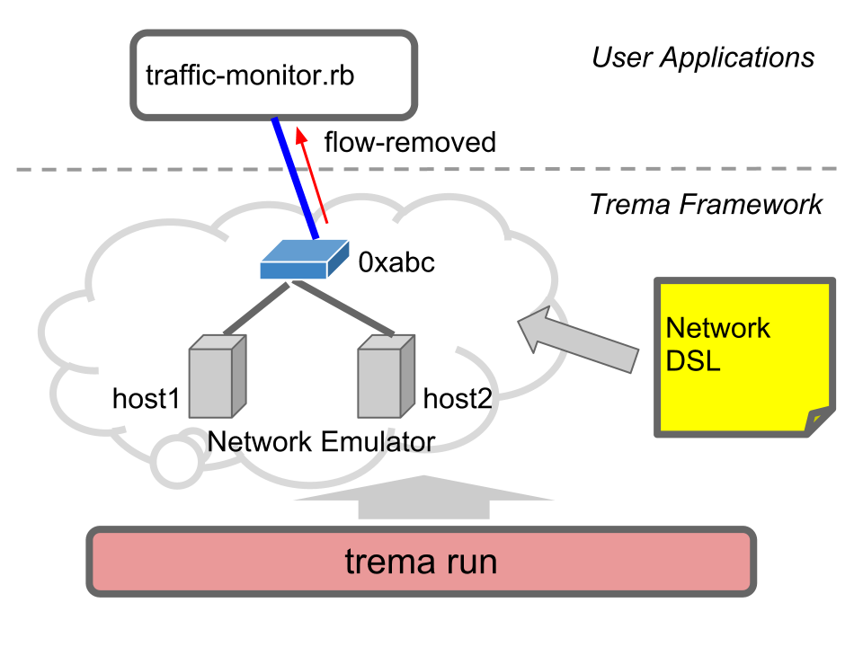

<!SLIDE small>
# Task E: Traffic Monitor ######################################################

## Getting traffic data from flow_removed messages

<!SLIDE smaller>
# Exercise: Displaying Traffic Data ############################################

	$ trema run traffic-monitor.rb -c traffic-monitor.conf

	# (On another terminal,)
	$ trema send_packets --source host1 --dest host2
	$ trema send_packets --source host1 --dest host2
	$ trema send_packets --source host2 --dest host1

* Launch a "L2 switch with traffic monitoring" controller
* Send test packets randomly
* The controller displays and updates the traffic stats of each host

<!SLIDE center>

<!SLIDE smaller>
# Getting Traffic Data #########################################################

	@@@ ruby
	class TrafficMonitor < Controller
	  # ...
	  def flow_removed dpid, message
	    @counter.add message.match.dl_src, message.byte_count
	  end
	      
	  private
	      
	  def flow_mod dpid, macsa, macda, out_port
	    send_flow_mod_add(
	      dpid,
	      :hard_timeout => 10,  # flows lifetime = 10 seconds.
	      :match => Match.new( :dl_src => macsa, :dl_dst => macda ),
	      :actions => ActionOutput.new( out_port )
	    )
	  end
	  # ...
	end

* Set each flow's lifetime to 10 seconds
* Handle flow\_removed messages generated when a flow timeouts
* Record the traffic amount transferred from the removed flow

<!SLIDE smaller>
# Displaying Traffic Info ######################################################

	@@@ ruby
	class TrafficMonitor < Controller
	  periodic_timer_event :show_counter, 10
	
	  # ...
	
	  private
	
	  def show_counter
	    puts Time.now
	    @counter.each_pair do | mac, nbytes |
	      puts "#{ mac } #{ nbytes } bytes"
	    end
	  end
	
	  # ...
	end

* Shows the current time and traffic data stored in `@counter` every 10 seconds

<!SLIDE smaller>
# Timer Attribute ##############################################################

	@@@ ruby
	class TrafficMonitor < Controller
	  periodic_timer_event :show_counter, 10
	
	  # ...
	
	  def show_counter ...
	end

* You can define timer handlers like a class attribute
* Don't need to implement timer handling by yourself using threads etc.
* Another example of <i>coding by convention</i>

<!SLIDE small>
# Traffic Monitor: Summary #####################################################

* Shows how to use the traffic data stored in flow_removed messages
* A practical example of learning switch controller
